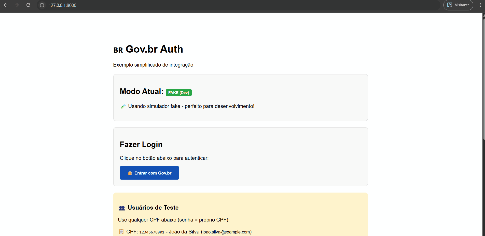

# GovBR Auth

<div align="center">

[](https://www.python.org/downloads/)
[](https://opensource.org/licenses/MIT)
[](https://fastapi.tiangolo.com/)
[](https://flask.palletsprojects.com/)
[](https://www.djangoproject.com/)

Autentique usuários com o Gov.br usando FastAPI, Flask, Django ou sua própria stack personalizada.

🧪 **Novo!** Modo fake integrado para desenvolvimento sem necessidade de cadastro no Gov.br!

</div>

---

## 💡 Motivação

A criação desta biblioteca nasceu de uma necessidade real: ao tentar integrar com o Login Único Gov.br, enfrentei diversas dificuldades iniciais —
desde entender o fluxo de autenticação com PKCE, até decidir qual abordagem seria mais segura: fazer tudo no frontend ou delegar ao backend?

Esta biblioteca oferece:
- ✅ Integração simplificada com Gov.br
- 🧪 Modo fake configurável para desenvolvimento
- 🔒 Implementação segura com PKCE
- 🚀 Suporte para FastAPI, Flask e Django
- 📦 API de baixo nível para stacks customizadas

Veja também: [🔒 Boas práticas adotadas](docs/boas_praticas_adotadas.md)

---

## ✨ Features

| Feature | Descrição | Status |
|---------|-----------|--------|
| 🔐 OAuth 2.0 + PKCE | Implementação completa do fluxo seguro | ✅ |
| 🌐 Multi-framework | FastAPI, Flask, Django | ✅ |
| 🧪 Modo Fake | Desenvolvimento sem Gov.br real | ✅ |
| 🔄 Async/Sync | Suporte para ambos paradigmas | ✅ |
| 🎯 Type Hints | Totalmente tipado com Pydantic | ✅ |
| 🔒 State Criptografado | Proteção contra CSRF | ✅ |
| 📝 Bem Documentado | Exemplos e guias completos | ✅ |
| 🧩 API Baixo Nível | Use sem frameworks | ✅ |
| ⚡ Configuração simples (Fake) | Habilite via flag/env para desenvolvimento | ✅ |
| 🎨 UI de Login (Fake) | Página estilizada para testes | ✅ |

---
## 🚀 Instalação

Instalação mínima (somente núcleo de serviços):
```bash
pip install govbr-auth
```

Instalação com framework específico:
```bash
pip install govbr-auth[fastapi]
# ou
pip install govbr-auth[flask]
# ou
pip install govbr-auth[django]
```

Instalação completa (todos os frameworks):
```bash
pip install govbr-auth[full]
```

---

## ⚡ Quick Start

```python
# 1. Instale a biblioteca
# pip install govbr-auth[fastapi]

# 2. Execute o exemplo pronto
import os
from fastapi import FastAPI
from govbr_auth import GovBrConfig, GovBrConnector, create_default_fake_users

# Configuração para modo fake (desenvolvimento)
config = GovBrConfig(
        client_id="fake-client-id",
        client_secret="fake-client-secret",
        redirect_uri="http://localhost:8000/auth/govbr/callback",
        cript_verifier_secret="Vvd9H5VC2Aqk-dwFOJX6MvQTuZZARmb37y7un9wkj0c=",
        govbr_auth_url="http://localhost:8000/fake-govbr/authorize",
        govbr_token_url="http://localhost:8000/fake-govbr/token",
        use_fake=True,
)

app = FastAPI()


# Callback de sucesso
def handle_success(data,
                   request):
    user = data["id_token_decoded"]
    return {"mensagem": f"Bem-vindo, {user['name']}!", "cpf": user["sub"]}


# Inicializa o connector (endpoints fake criados automaticamente!)
connector = GovBrConnector(
        config=config,
        on_auth_success=handle_success,
        fake_users=create_default_fake_users()
)
connector.init_fastapi(app)

# 3. Execute: uvicorn seu_arquivo:app --reload
# 4. Acesse: http://localhost:8000/auth/govbr/authorize
# 5. Use CPF: 12345678901 | Senha: 12345678901
```

💡 **Próximos passos**: Configure o [Gov.br real](#️-configuração) quando estiver pronto para homologação/produção.

---

## ⚙️ Configuração

Via `.env`:
```env
GOVBR_REDIRECT_URI=
GOVBR_CLIENT_ID=
GOVBR_CLIENT_SECRET=
GOVBR_CODE_CHALLENGE_METHOD=S256
GOVBR_SCOPE=openid profile email
GOVBR_RESPONSE_TYPE=code
CRIPT_VERIFIER_SECRET=
GOVBR_AUTH_URL=https://sso.staging.acesso.gov.br/authorize
GOVBR_TOKEN_URL=https://sso.staging.acesso.gov.br/token
USE_FAKE_GOVBR=false
JWT_SECRET=chave_super_secreta
JWT_EXPIRES_MINUTES=60
JWT_ALGORITHM=HS256
```

Ou via código:
```python
from govbr_auth.core.config import GovBrConfig

config = GovBrConfig(
        client_id="...",
        client_secret="...",
        redirect_uri="https://...",
        cript_verifier_secret="...",
)
```

## 🔑 Gerando o `cript_verifier_secret`
Certifique-se de gerar um valor único e seguro para o `cript_verifier_secret`.
Esse valor deve ser mantido em segredo e não deve ser compartilhado publicamente, pois é usado para proteger a troca de tokens entre o cliente e o servidor de autenticação.
Você pode usar a função `generate_cript_verifier_secret` para isso.
```python
from govbr_auth.utils import generate_cript_verifier_secret
print(generate_cript_verifier_secret())
# gera um valor válido para o `cript_verifier_secret`, exemplo: Vvd9H5VC2Aqk-dwFOJX6MvQTuZZARmb37y7un9wkj0c=

```

---

## 🧪 Modo Fake Gov.br (Desenvolvimento)

<p align="center">
  
</p>

**Novo!** A biblioteca agora possui um simulador do gov.br, ao ativar o modo fake são criados endpoints simulados do Gov.br sem necessidade de configuração adicionais!

### Por que usar o modo fake?

- 🚀 **Desenvolvimento rápido**: Não precisa cadastrar sua aplicação no Gov.br
- 🧪 **Testes facilitados**: Usuários de teste pré-configurados
- 🔄 **Fluxo completo**: Simula todo o processo OAuth 2.0 com PKCE
- 🎨 **Interface visual**: Página de login estilizada para testes
- 🔌 **Configuração explícita**: Ative via flag/env quando precisar do simulador

### Como ativar

O modo fake agora é **opt-in**. Defina `use_fake=True` (ou `USE_FAKE_GOVBR=true` no `.env`) e aponte as URLs para os endpoints fake.

```python
from govbr_auth import GovBrConfig, GovBrConnector, create_default_fake_users

config = GovBrConfig(
        client_id="fake-client-id",
        client_secret="fake-client-secret",
        redirect_uri="http://localhost:8000/auth/govbr/callback",
        cript_verifier_secret="Vvd9H5VC2Aqk-dwFOJX6MvQTuZZARmb37y7un9wkj0c=",
        govbr_auth_url="http://localhost:8000/fake-govbr/authorize",
        govbr_token_url="http://localhost:8000/fake-govbr/token",
        use_fake=True,
)
```

Ou via `.env`:

```bash
USE_FAKE_GOVBR=true
GOVBR_CLIENT_ID=fake-client-id
GOVBR_CLIENT_SECRET=fake-client-secret
GOVBR_REDIRECT_URI=http://localhost:8000/auth/govbr/callback
CRIPT_VERIFIER_SECRET=Vvd9H5VC2Aqk-dwFOJX6MvQTuZZARmb37y7un9wkj0c=
GOVBR_AUTH_URL=http://localhost:8000/fake-govbr/authorize
GOVBR_TOKEN_URL=http://localhost:8000/fake-govbr/token
```

```python
config = GovBrConfig.from_env()
```

```python
# Opcional: customize os usuários de teste
fake_users = create_default_fake_users()  # ou crie seu próprio dict

connector = GovBrConnector(
        config=config,
        on_auth_success=handle_success,
        fake_users=fake_users  # opcional
)

# Endpoints fake são registrados automaticamente quando use_fake=True
connector.init_fastapi(app)
```

### Endpoints fake criados automaticamente

Quando `use_fake=True` está configurado, os seguintes endpoints são criados automaticamente:

- `GET /fake-govbr/authorize` - Página de login fake (HTML)
- `POST /fake-govbr/login` - Processar autenticação
- `POST /fake-govbr/token` - Trocar code por token
- `GET /fake-govbr/users` - Listar usuários disponíveis (JSON)

### Usuários de teste padrão

| CPF | Nome | E-mail | Senha |
|-----|------|--------|-------|
| 12345678901 | João da Silva | joao.silva@example.com | 12345678901 |
| 98765432100 | Maria Oliveira | maria.oliveira@example.com | 98765432100 |
| 11122233344 | José Santos | jose.santos@example.com | 11122233344 |

> 💡 **Dica**: A senha é sempre o próprio CPF!

### Customizando usuários fake

```python
from govbr_auth.fake_govbr import FakeUserData

fake_users = {
    "11111111111": FakeUserData(
        cpf="11111111111",
        nome="Teste da Silva",
        email="teste@example.com",
        picture="https://exemplo.com/foto.jpg"  # opcional
    ),
    "22222222222": FakeUserData(
        cpf="22222222222",
        nome="Usuário Teste",
        email="usuario@example.com"
    )
}

connector = GovBrConnector(config, fake_users=fake_users)
```

### Exemplo completo

Veja um exemplo funcional em [`examples/example_simple_app.py`](examples/example_simple_app.py)

Para Django, consulte o projeto executável em [`examples/django_example/`](examples/django_example/README.md).

```bash
# Rodar em modo fake
USE_FAKE_GOVBR=true uvicorn examples.example_simple_app:app --reload

# Acessar em http://localhost:8000
```

📚 **Para documentação completa do modo fake**, veja: [docs/modo_fake.md](docs/modo_fake.md)

---

## 🧩 Uso com FastAPI
```python
from fastapi import FastAPI
from govbr_auth.controller import GovBrConnector
from govbr_auth import GovBrConfig, create_default_fake_users

def after_auth(data, request):
    user = data["id_token_decoded"]
    return {
        "mensagem": "Login efetuado com sucesso!",
        "usuario": user["name"],
        "cpf": user["sub"]
    }

config = GovBrConfig.from_env()  # ou configure manualmente

app = FastAPI()
connector = GovBrConnector(
    config,
    prefix="/auth/govbr",
    authorize_endpoint="authorize",
    authenticate_endpoint="authenticate",
    on_auth_success=after_auth,
    fake_users=create_default_fake_users()  # opcional, apenas para modo fake
)
connector.init_fastapi(app)

# Se usar `use_fake=True` na config, endpoints fake são criados automaticamente!
```

## 🌐 Uso com Flask
```python
from flask import Flask, jsonify, request
from govbr_auth import GovBrConnector, GovBrConfig, create_default_fake_users

def after_auth(data, request):
    user = data["id_token_decoded"]
    return jsonify({
        "mensagem": "Login efetuado com sucesso!",
        "usuario": user["name"],
        "cpf": user["sub"]
    })

config = GovBrConfig.from_env()

app = Flask(__name__)
connector = GovBrConnector(
    config,
    prefix="/auth/govbr",
    authorize_endpoint="authorize",
    authenticate_endpoint="authenticate",
    on_auth_success=after_auth,
    fake_users=create_default_fake_users()  # opcional, apenas para modo fake
)
connector.init_flask(app)

# Se usar `use_fake=True` na config, endpoints fake são criados automaticamente!
```

## 🛠️ Uso com Django
```python
from django.http import JsonResponse
from govbr_auth import GovBrConnector, GovBrConfig, create_default_fake_users

def after_auth(data, request):
    user = data["id_token_decoded"]
    return JsonResponse({
        "mensagem": "Usuário autenticado!",
        "nome": user.get("name"),
        "cpf": user.get("sub")
    })

config = GovBrConfig.from_env()

connector = GovBrConnector(
    config,
    prefix="auth/govbr",
    authorize_endpoint="authorize",
    authenticate_endpoint="authenticate",
    on_auth_success=after_auth,
    fake_users=create_default_fake_users()  # opcional, apenas para modo fake
)

urlpatterns = [
    *connector.init_django(),
]

# Se usar `use_fake=True` na config, endpoints fake são criados automaticamente!
```

## 🧱 Uso com Stack Personalizada (baixo nível)
Você pode usar os serviços principais diretamente, de forma **assíncrona ou síncrona**:

### Async
```python
from govbr_auth.core.govbr import GovBrAuthorize, GovBrIntegration

authorize = GovBrAuthorize(config)
auth_url = authorize.build_authorize_url()

integration = GovBrIntegration(config)
result = await integration.async_exchange_code_for_token(code, state)
```

### Sync
```python
from govbr_auth.core.govbr import GovBrAuthorize, GovBrIntegration

authorize = GovBrAuthorize(config)
auth_url = authorize.build_authorize_url_sync()

integration = GovBrIntegration(config)
result = integration.exchange_code_for_token_sync(code, state)
```

Ideal para:
- APIs customizadas
- Serviços Lambda/FaaS
- Apps que não usam frameworks web tradicionais


## 📌 Endpoints Disponíveis

### Endpoints de Autenticação (padrão)

- `GET /auth/govbr/authorize` → Retorna a URL de autorização Gov.br com PKCE
- `POST /auth/govbr/authenticate` → Recebe `code` e `state`, troca por tokens e retorna dados decodificados

> Os caminhos podem ser personalizados via parâmetros do `GovBrConnector`

### Endpoints Fake (modo desenvolvimento)

Quando `use_fake=True` está configurado, os seguintes endpoints são criados automaticamente:

- `GET /fake-govbr/authorize` → Página de login fake (HTML estilizado)
- `POST /fake-govbr/login` → Processar login com CPF/email
- `POST /fake-govbr/token` → Trocar code por token (OAuth)
- `GET /fake-govbr/users` → Listar usuários de teste disponíveis (JSON)

---

## 📚 Documentação Adicional

- 📖 [Boas Práticas Adotadas](docs/boas_praticas_adotadas.md) - Entenda as decisões de segurança e arquitetura
- 🧪 [Modo Fake Gov.br](docs/modo_fake.md) - Guia completo sobre desenvolvimento com o simulador
- 📝 [CHANGELOG](CHANGELOG.md) - Histórico de mudanças e versões
- 🚀 [Exemplo Completo](examples/example_simple_app.py) - App FastAPI funcional com modo fake

---

## ✅ Testes
```bash
pytest tests/
```

## 📁 Estrutura do Projeto

```
govbr_auth/
├── govbr_auth/
│   ├── core/
│   │   ├── config.py      # Configurações e validação
│   │   └── govbr.py       # Lógica principal OAuth 2.0 + PKCE
│   ├── controller.py      # Conectores para frameworks
│   ├── fake_govbr.py      # Serviço fake para desenvolvimento
│   └── utils.py           # Utilitários (geração de secrets, etc)
├── examples/
│   └── example_simple_app.py  # Exemplo funcional completo
├── tests/                 # Testes automatizados
└── docs/
    └── boas_praticas_adotadas.md  # Documentação técnica

```

## 🤝 Contribuindo

Antes de começar, leia o [guia de contribuição](CONTRIBUTING.md) e o [Código de Conduta](CODE_OF_CONDUCT.md).

- Encontrou um defeito reproduzível? [Relate um bug](https://github.com/cereja-project/govbr_auth/issues/new?template=bug_report.yml).
- Precisa de uma nova capacidade? [Proponha uma funcionalidade](https://github.com/cereja-project/govbr_auth/issues/new?template=feature_request.yml).
- Quer implementar uma mudança? Verifique as [issues existentes](https://github.com/cereja-project/govbr_auth/issues) e mantenha o pull request focado.

## 🐛 Reportando Problemas

Use os formulários acima e remova credenciais, tokens, chaves e dados reais de usuários antes de enviar logs ou exemplos.

## 📄 Licença
MIT

