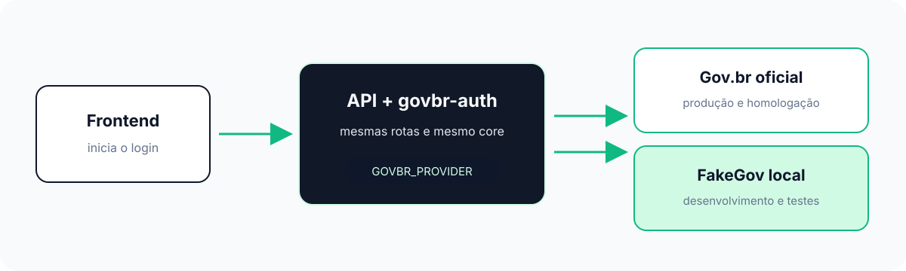
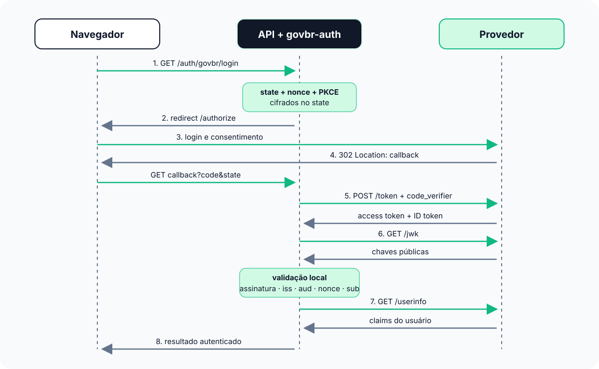

Fluxo completo de comunicação
=============================

O ``govbr-auth`` atua no backend da aplicação. O frontend da aplicação não
fala diretamente com o Gov.br nem com o FakeGov: ele chama a API, e a API
coordena todo o fluxo OAuth/OIDC.

Visão geral
-----------

O mesmo backend pode usar o Gov.br oficial ou o FakeGov. A troca de provedor
ocorre na composição do runtime, sem alterar o código do frontend ou da API.

O FakeGov é um simulador do provedor. Ele não é o frontend da aplicação. A
interface HTML de login que ele oferece existe somente para representar a tela
que normalmente seria apresentada pelo provedor durante o redirect OAuth.

Fluxo recomendado: callback na API
----------------------------------

O ``GOVBR_REDIRECT_URI`` deve apontar para a API, por exemplo::

    GOVBR_REDIRECT_URI=https://api-dev.example.com/auth/govbr/callback

O frontend inicia o login pela API. Depois que o provedor conclui a
autorização, o navegador volta para o callback da API. Assim, o backend pode
manter o ``state``, o nonce, o PKCE e a troca de tokens sob seu controle.

O navegador nunca precisa receber o client secret, o access token ou o ID
Token para que a API conclua a autenticação.

Provedor oficial
----------------

Com ``GOVBR_PROVIDER=official``:

* a API redireciona o navegador para os endpoints oficiais;
* a API troca o authorization code diretamente com o Gov.br;
* a API busca o JWKS e consulta ``userinfo``;
* o core valida ``state``, PKCE, nonce, assinatura, issuer, audience e subject.

FakeGov embutido na API
-----------------------

Com ``GOVBR_PROVIDER=fake``, as rotas do FakeGov são montadas na mesma API
FastAPI. Não é necessário iniciar outro processo. O frontend continua chamando
a API, e o navegador acessa as rotas FakeGov durante o redirect. As chamadas
internas da API para ``token``, ``jwk`` e ``userinfo`` usam
``FakeGovHttpTransport``. A sequência é a mesma do diagrama acima; apenas o
destino das chamadas do provedor muda para a aplicação HTTP neutra montada
localmente.

O FakeGov simula as respostas do provedor; as regras de segurança continuam
sendo responsabilidade do core e do fluxo da API.

Página de demonstração da aplicação
-----------------------------------

``GovBrApplicationSettings.from_environment()`` lê o opt-in da aplicação:

.. code-block:: text

   GOVBR_PROVIDER=fake
   GOVBR_DEMO_PAGE=true

O adapter injeta ``/govbr-auth-demo`` e apresenta o botão
**Entrar com gov.br**. Com ``demo_page=false``, a rota não é injetada. O
provedor oficial usa a mesma página sem simulação e redireciona para o Gov.br.
A rota fixa pode colidir com uma rota existente, e verificar essa colisão é
responsabilidade do integrador.

O launcher ``python -m govbr_auth.fake`` permanece ``provider-only`` sem flag
adicional: ele publica o provedor local, não a página da aplicação.

FakeGov compartilhado
---------------------

O mesmo modelo pode ser publicado em uma API acessível aos desenvolvedores e
testadores. Nesse caso, a API expõe suas rotas FakeGov e o frontend usa a URL
pública da API. A configuração precisa distinguir a origem pública usada pelo
navegador do transporte interno usado pela API.

A implementação atual usa loopback como padrão de segurança para o launcher
local. Um modo compartilhado exige uma configuração explícita de origem
pública, além de isolamento de usuários e tokens de teste, rotação de chaves,
TLS e controles administrativos.

Escolha do modo
---------------

``GOVBR_PROVIDER=official`` (padrão)
    Usa os endpoints oficiais configurados.

``GOVBR_PROVIDER=fake``
    Monta o FakeGov na mesma API e usa ``FakeGovHttpTransport`` para as
    chamadas do backend.

``GOVBR_DEMO_PAGE=true``
    Habilita a página fixa ``/govbr-auth-demo`` na aplicação consumidora. É um
    opt-in independente do provider selecionado.
