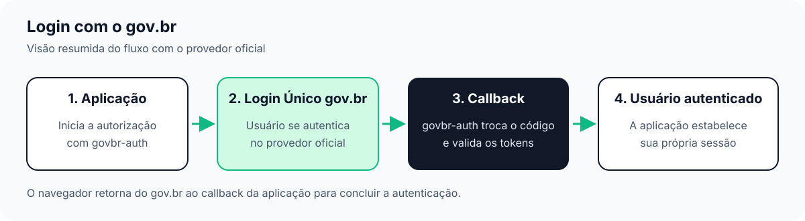

GovBR Auth
==========

Engine de autenticação Gov.br com adapters opcionais para FastAPI, Django e
Flask, usando OAuth 2.0, PKCE e OpenID Connect. O cliente valida ``state``, tokens RS256 por JWKS, ``issuer``,
``audience``, ``nonce`` e o vínculo do ``subject``.

O núcleo de composição é neutro de framework. Os adapters são instalados por
extras e se acoplam à aplicação hospedeira.

As transações OAuth são stateless: múltiplos workers processam callbacks sem
armazenamento compartilhado quando recebem a mesma secret
``GOVBR_TRANSACTION_SECRET``. O envelope Fernet tem TTL e carrega os vínculos
de PKCE e nonce. O ``state`` não é um registro de uso único; o replay é
rejeitado pelo authorization code de uso único no provedor.

O ``govbr-auth`` conduz a autorização e valida os tokens. A aplicação
consumidora decide como estabelecer a sessão do usuário autenticado.
Veja o :doc:`guide/communication-flow` para a sequência técnica detalhada.

O :doc:`guide/fake-mode` permite executar o fluxo completo localmente com
usuários fictícios, sem alterar a fachada usada com o provedor oficial.

.. toctree::
   :maxdepth: 2
   :caption: Guia

   guide/quick-start
   guide/fake-mode
   guide/demo-debug
   guide/communication-flow
   guide/configuration
   guide/brand
   guide/troubleshooting

.. toctree::
   :maxdepth: 2
   :caption: Referência da API

   api/core
   api/fastapi
   api/django
   api/flask
   api/fake-govbr

.. toctree::
   :maxdepth: 1
   :caption: Versões

   CHANGELOG
   guide/releasing

Índice e busca
==============

* :ref:`genindex`
* :ref:`search`
